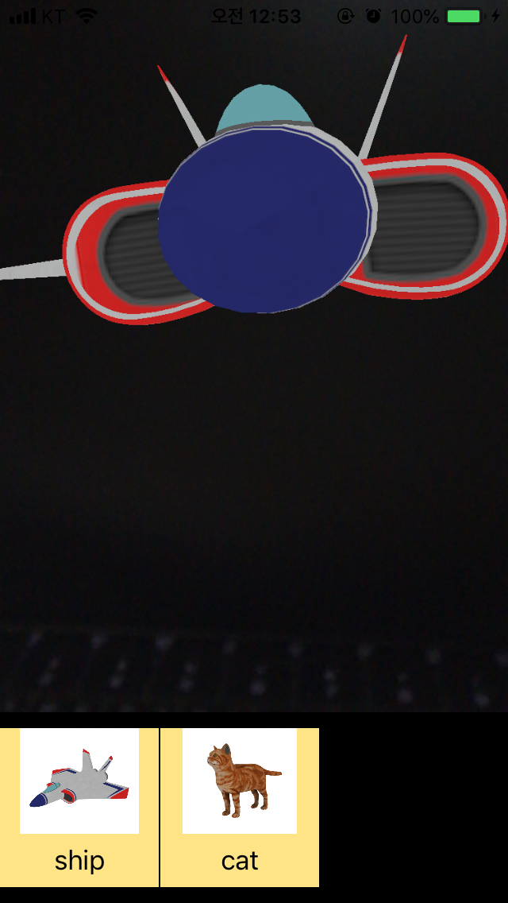
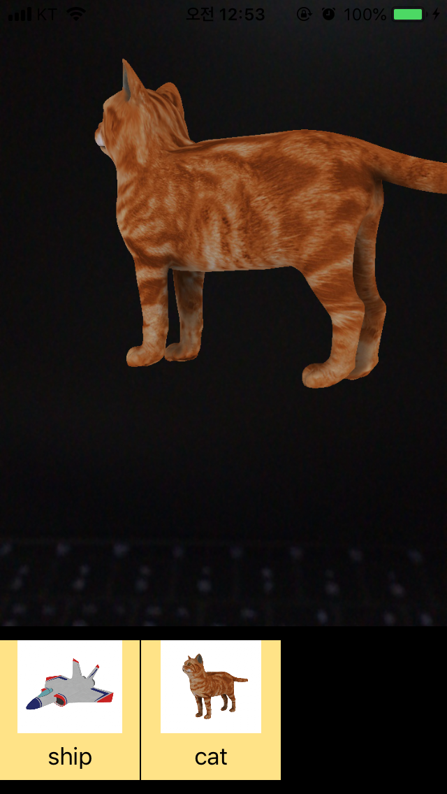

# 3DModelingViewer

3D Modeling 오브젝트를 모바일 iOS에서 AR로 보여주기 위한 뷰어 앱

## step 1

> 기획
 
 - 목적 : 3D Modeling Obj을 iOS 모바일에서 AR로 보여주기 위함.
 - 기능
 	- iOS 사진 App에서 사진 편집 UI로 3D Model을 선택하여 뷰에서 볼 수 있도록 한다.
 	
 		cf, 
 		
 		
 	- 3D Model Obj파일과 texture는 드롭박스나 구글드라이브에서 가져올 수 있도록 한다.
 	- 화면 터치로 3D Model을 360도 돌려서 볼 수 있도록 한다. (아직 가능 여부 미확인)
 
> 개발
 
 - UI 개발
 	- 첫 화면에 ARSCNView와 UICollectionView가 둘 다 보이도록 구현 (위의 사진 App 사진 편집 UI 참고)
 	- UICollectionView는 가로 스크롤 설정
 	- UICollectionView cell에 3D Model sample 이미지 및 타이틀 적용
 	- 사용자에 의해 selected 된 UICollectionView의 Cell에 해당하는 3D Model을 ARSCNView에 보여줌

> 실행 화면 (일단 sample 3D Model 적용)
 
 - main 
	
	  
	